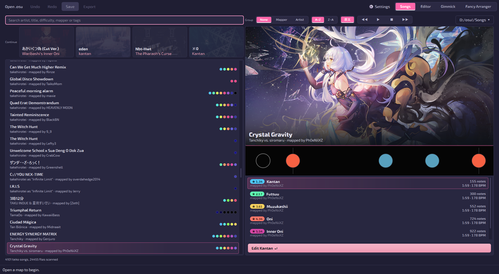
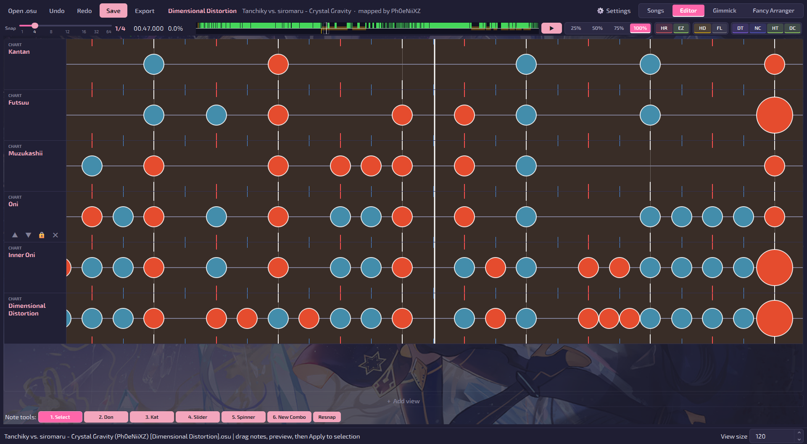
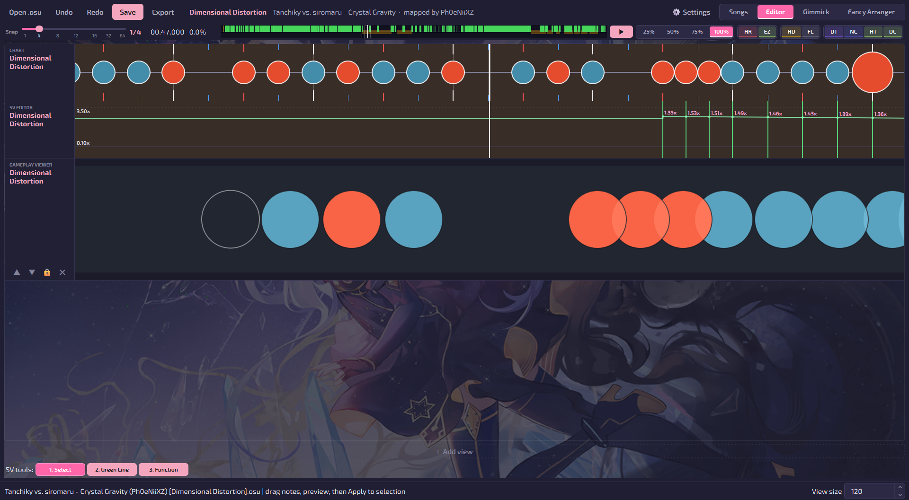
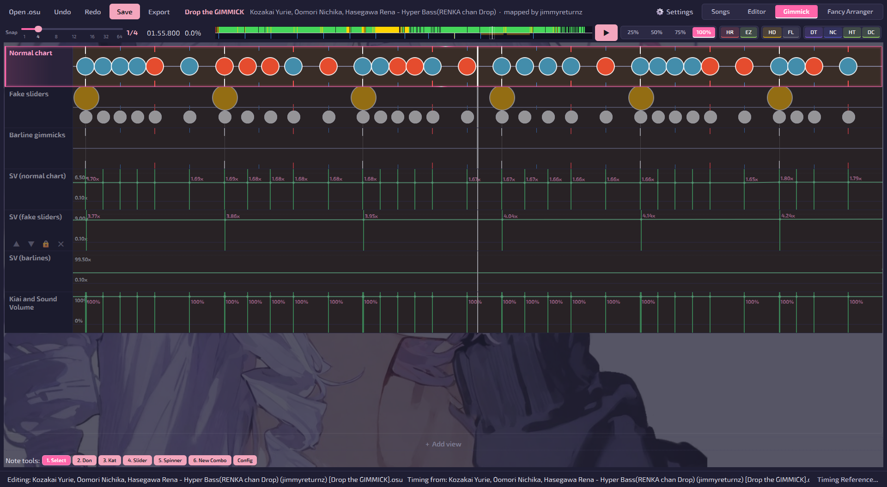
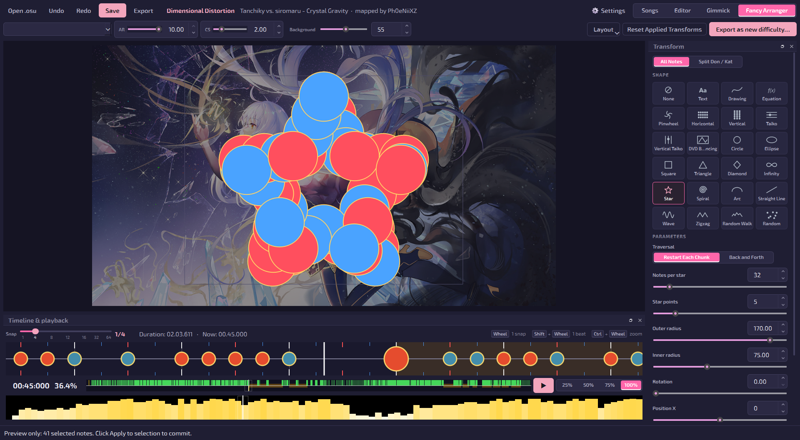
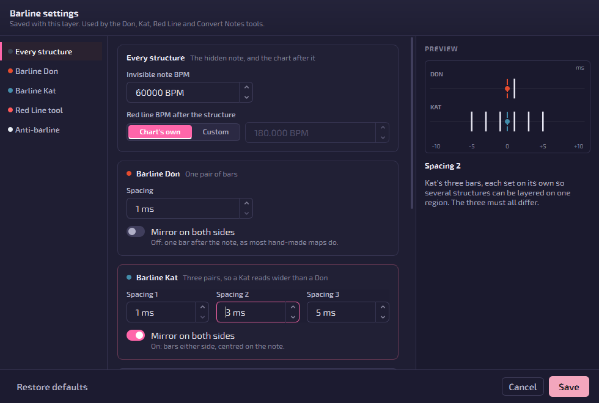
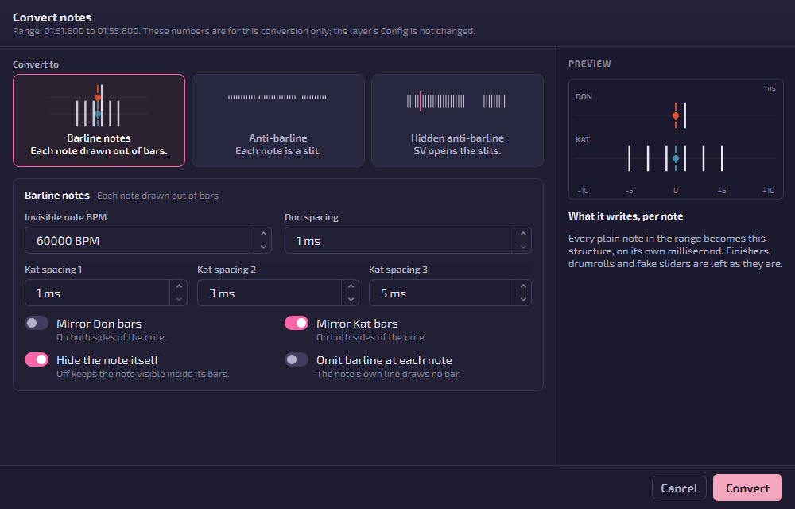
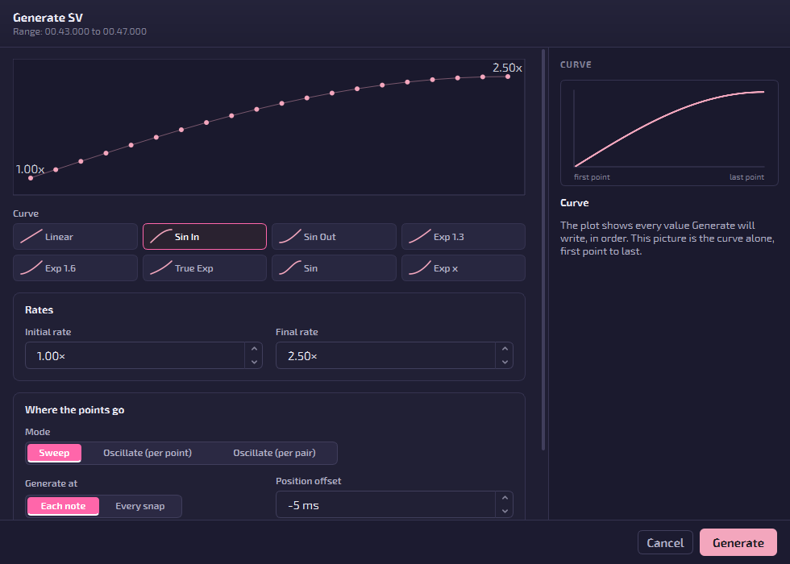
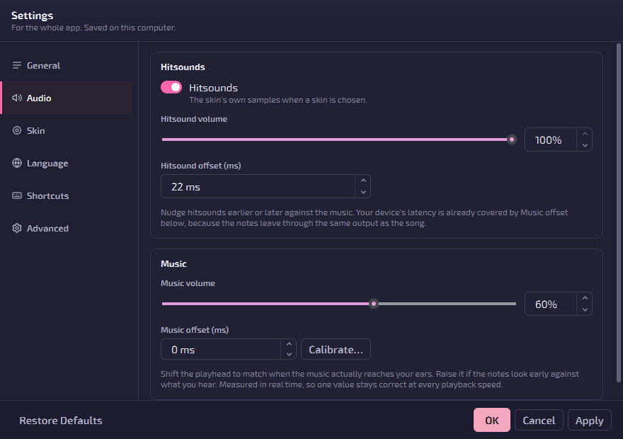

# TaikoFancyEditor

使い方の質問やアイデアの提案、バグ報告などがあれば、僕のosu!ネームは[jimmyreturnz](https://osu.ppy.sh/users/11306153)です。\
Discordもjimmyreturnzです。よろしくお願いします！

**ビジュアルパターンアレンジャーとギミックエディターを内蔵した osu!taiko エディター**

> 英語版は [README.md](README.md) を参照してください。

Taiko Fancy Arrangerは、osu!taikoのノーツを手作業で1つずつ置くことなく、テキスト・図形・数式・絵・らせん、さらには画像といった視覚的なパターンへ変換するツールとして始まりました。バージョン2.0.0でエディターへと成長し、osu!のSongsフォルダを閲覧して難易度を開き、ノーツとスクロールベロシティ（SV）を編集し、osu!が描画する通りにチャートをプレビューしつつ、望めばノーツをパターンに配置することもできるようになりました。バージョン3.0.0では、ノーツではなくタイミングポイントから作られるフェイクスライダー・小節線ギミック・極端なSV効果のための専用ギミックエディターを追加しています。

ストーリーボード、ブレイク、色、エディターのブックマークの編集にはまだ対応していません。

> **現行リリース:** v3.5.0
> **プラットフォーム:** Windows x64
> **作者:** [jimmyreturnz](https://osu.ppy.sh/users/11306153)

主なインスピレーションは、Alchyrのランク譜面 *13 Stairs* と *Helios* です。これらは通常とは異なるノーツ配置で視覚的な表現を作り出しています。ぜひ[こちら](https://osu.ppy.sh/beatmapsets/1093671#taiko/3819326)をチェックしてみてください。

## クレジット
- [AlchyrのTaikoEditor](https://github.com/Alchyr/TaikoEditor)
- 研究の参考にさせていただいた {Mew, _gt, Alchyr} さんの譜面、本当にありがとうございます！

---

**曲選択**：osu!.dbからの★難易度に、背景と曲のプレビューが付きました！



**エディター**：複数の難易度を同時に編集でき、難易度間のコピー＆ペーストもできます。



**ゲームプレイプレビュー**：osu!のプレイフィールドの大きさに合わせました。



**ギミックエディター**：フェイクスライダー、小節線、各レイヤーのSVなど、ギミックの種類ごとに1レイヤー。



**Fancy Arranger**：ノーツを図形、テキスト、画像に変形します。



**設定シート**：シートのUIを改善し、より直感的にしました。

| | |
|---|---|
|  |  |
|  |  |

---

## 3.5.0の新機能

譜面を中心に作り直した選曲画面、その場で切り替わるテーマ、動かせるビュー。

- **選曲画面で背景の下に譜面が流れます**。SV と BPM もそのまま反映され、背景の下のビートの帯は隠れたシークバーです。
- **ビューは見出しをドラッグして並べ替えられます。** フォーカス中のビューは縁に光が走り、ほかのビューは薄くなります。Esc か空いている所のクリックでフォーカスを外せます。
- **テーマは選んだ瞬間に切り替わります**（再起動不要）：**osu!**（既定）、**太鼓**、**Lantern Rite**、**Gold**、**Monokai**。
- **密度は譜面で最も長く使われている BPM を基準に**、曲の1%ごとに1本で表示します。
- **大音符は小音符の音に大音符の音を重ねて鳴らし**、譜面ビューでは3分の1大きく表示します。
- **修正**：EGTS 2022 パックが読み込めない問題、選曲画面のプレビューのカクつき、貼り付けたスピナーの長さが変わる問題。

詳細: [`docs/releases/v3.5.0.md`](docs/releases/v3.5.0.md)

---

## Windows SmartScreenに関する注意

Taiko Fancy Arranger v3.5.0は現時点で署名されていないWindowsアプリケーションです。このリリースにはソースレベルのセキュリティ強化、入力値検証、より安全なファイル処理、自動テスト、公開されたSHA-256チェックサムが含まれています。

実行ファイルがまだダウンロード評価を確立していないため、Windows Defender SmartScreenが「認識されないアプリ」の警告を表示することがあります。

---

## 対応言語

現在、英語と日本語に対応しています。私自身タイ人であるにもかかわらず、タイ語翻訳はまだありません😂

言語は初回起動時に選択し、**設定** で後から変更できます。変更すると再起動を求められます。これはQtが既存のウィジェットを再翻訳しないためです。

---

## ダウンロードと実行

1. リポジトリの**Releases**ページを開きます。
2. 次のファイルをダウンロードします。

```text
TaikoFancyArranger-Windows-x64.zip
```

3. ZIPをすべて展開します。
4. 次を実行します。

```text
TaikoFancyArranger.exe
```

5. 手動でダウンロードするのはこれが最後です。新しいバージョンが出ると、起動時にパッチノートが表示されます。**更新して再起動**を押すと、同じフォルダーにインストールされて再起動します。設定とショートカットはそのまま残ります。フォルダーは書き込みできる場所に置いてください（`Program Files`は不可）。

ポータブル版のWindowsリリースには、PythonとPySide6が同梱されています。リリースZIPを使うプレイヤーは、Pythonのインストールも`pip`の実行も必要ありません。

> 署名されていない新しいアプリケーションのため、Windowsが評価に関する警告を表示することがあります。実行する前にリポジトリとリリースファイルを確認してください。

---

## 初回起動

1. **言語を選択します。** EnglishまたはJapanese（日本語）。
2. **osu!のSongsフォルダを選択します。** `%LOCALAPPDATA%/osu!/Songs` が存在する場合はあらかじめ入力されています。フォルダは記憶され、ライブラリページから後で変更できます。
3. **スキャンを待ちます。** 初回のスキャンはすべての`.osu`ファイルを一度読み込むため、コレクションが大きいと時間がかかります。処理は分割して実行されるため、ウィンドウは応答し続けます。2回目以降の起動では、検証前にキャッシュされたリストが表示されます。スキャン中もアプリは使えますが、エディターやosu!の動作はあまり滑らかではありません。スキャンが終わるのを待つか、編集したい譜面だけを入れた小さなフォルダーを作ることをおすすめします。

フォルダ選択をキャンセルすると、**フォルダーを変更**ボタン付きの空のライブラリになります。

---

## 曲ライブラリ

ライブラリページが入り口です。

- 左側: `アーティスト - 曲名 · マッパー · 難易度数` として表示される曲一覧。
- 右側: 選択した曲の難易度一覧。
- 難易度をダブルクリックするか、**この難易度を編集**を押すと、エディターで開きます。

コントロール:

- **検索** — アーティスト、曲名、両方のUnicode表記、難易度名、作成者、タグを一度にマッチさせます。osu!と同じ動作です。
- **グループ化** — なし、マッパー別、アーティスト別。
- **並び順** — A→Zまたは Z→A。これによりグループの順序も反転します。
- **原語のメタデータ** — ローマ字表記の代わりに`ArtistUnicode`/`TitleUnicode`を表示し、それが無い場合はマップが実際に持っている方にフォールバックします。
- **音楽プレイヤー** — 前の曲、再生 / 一時停止、停止、次の曲。前の曲と次の曲は、セッション中は固定のシャッフル順で曲をたどり、その曲を選択します。**Space**で一時停止と再開ができます（検索の入力中を除く）。
- **Songsフォルダーのメニュー** — クイックスキャン、すべて再スキャン、**このビートマップを再読み込み**（`F5`、選択中の曲のファイルだけを読み直します）、フォルダーを変更。

プレビューは、どのMODを選んでいても1.00倍・元のピッチで再生されます。MODはエディターで適用されます。

太鼓の譜面のみが一覧に表示されます。

曲ライブラリは近いうちに作り直す予定です。お楽しみに！

---

## エディターページ

エディターページはビューを難易度ごとにまとめて縦に並べます。**+ ビューを追加**（ビュー種類＋難易度）でビューを開くか、ビューの下の空いている場所を右クリックします。難易度を開くと、自動的にチャートビューとSVビューが与えられます。

ページの背後には譜面自身の背景が薄く表示されます。**設定 → エディターの背景 → 背景の不透明度**で濃さを決められ（0%で無地）、ドラッグ中にそのまま反映されます。

**Ctrl**を押しながらだと、スナップ分割数に関わらず1ミリ秒精度で配置でき、各ビューの隅にガイドラインとミリ秒のリアルタイム読み取り値が表示されます。

ビューの種類:

| ビュー | 内容 |
|---|---|
| チャート | スナップグリッド付きの、時間軸上のノーツ |
| SVエディター | 赤・緑・黄色のタイミングラインと、実効SVグラフ |
| プレイビューアー | 読み取り専用のosu!taikoゲームプレイプレビュー |
| 密度 | 白から黄色へのノーツ密度ヒートマップ |

複数の難易度を同時に編集することもできます。Ctrl+Sで変更したすべての難易度を一度に保存し、エディターとギミックエディターはそれぞれ開けるビューの一覧を持っています。

### ノート編集

ツールバーはページ下部にあり、フォーカスされているチャートビューに対して動作します。

```text
1  Select
2  Don
3  Kat
4  Slider
5  Spinner
6  New combo
```

- 左クリックでスナップされた時間に配置され、半透明のゴースト表示で配置先がプレビューされます。
- スライダーとスピナーは**クリックドラッグ**で長さを決めます。既存のものの右端付近を押すとリサイズでき、その後**選択**ツールで終端をドラッグすることもできます。
- **Shift**を押しているとノーツが大ノーツ（フィニッシャー）のサイズになります。
- 右クリックでカーソル下のノーツを削除します。
- スピナーを除き、1ミリ秒につき1オブジェクトです。ノーツの上に配置すると、それを置き換える1回のUndo単位の操作になります。

### SV編集

SVビューがフォーカスされていると、ツールバーは次のようになります。

```text
1  Select
2  Green line
3  Function
```

- 赤線は継承なし（BPM）ポイント、緑線は継承あり（SV）ポイント、黄色は両方が同じミリ秒を共有していることを意味します。
- 緑線をクリックすると選択され、縦にドラッグするとSVが変わり、横にドラッグするとグリッドにスナップされた形でリタイミングされます。どちらの軸になるかは、クリック位置が値のドットにどれだけ近いかによります。
- 縦のドラッグは、押した位置から1ピクセルにつき`0.01`ずつSVを変えます。
- 緑線を削除しても赤線は削除されません。
- タイミングラインをダブルクリックすると、キアイまたはそのラインの小節線省略フラグを切り替えられます。
- グラフは**実効**SVを表示します——両方存在する場合は緑が赤の上に重なり——固定の0.1x下限と自動スケーリングされる上限を持ちます（下限は0.01xに変更予定）。

**関数モード:** 範囲をドラッグしてから、初期倍率、最終倍率、位置オフセット、最初の小節線を省略するかどうか、スイープが最終BPMに対して相対的かどうかを選びます。7つのカーブがタイルとして提示され、それぞれ実際に入力した値通りのスイープを描画します。

```text
linear   sin in   sin out   exp1.3   exp1.6   true exp   sin
```

ポイントは既定では範囲内のノーツ上に生成されるか、Nスナップごとに生成されます。既定の−5msオフセットにより、そのノーツが来た時点で既にSVが効いていることが保証されます。生成したポイントがいくつであっても、それは1回のUndo単位です。

実験用に、exp(x>=1)のSVを選べるオプションもいずれ追加する予定です。

### エディターのショートカット

```text
Space               Play or pause
Ctrl+Z / Ctrl+Y     Undo / redo (per difficulty)
Ctrl+C / Ctrl+V     Copy / paste notes or SV points, snapped on paste
Ctrl+S              Save every changed difficulty
Ctrl+A              Select all in the focused view
Delete              Delete the selection
Esc                 Back to the song list
1 - 6               Tools, routed to whichever tool row is showing
Mouse wheel         Seek by one snap
Shift+wheel         Seek by one beat
Ctrl+wheel          Zoom
Alt+wheel           Change beat snap
```

これらはすべて**設定**で再割り当て可能です。ただし`Delete`と`Ctrl+A`はフォーカスされているビューに属しているため例外です。

未保存の変更を残したままエディターを離れようとすると、未保存の難易度が名前付きで一覧表示され、**保存**、**保存せずに続行**、**キャンセル**のいずれかを選べます。保存せずに続行すると、編集内容はセッション内に残り、何も保存されません。

---

## ギミックエディターページ

osu!taikoにおける「ギミック」とは、ノーツではなくタイミングポイントから作られる視覚効果のことです。負の長さで描画されるだけで叩けないドラムロール（「フェイクスライダー」）、小節線から描かれるノーツ、そしてオブジェクトを画面上で動かすために使われる極端なBPM/SV値がこれにあたります。

ギミックページは、1つの難易度の上に6層を重ねます。通常のチャート、フェイクスライダーレイヤー、小節線ギミックレイヤー、そしてその3つそれぞれのSVレイヤーです。

ある難易度でこのページに入ると、その難易度をそのまま編集するか新しい`[Gimmick]`難易度にコピーするかを一度だけ尋ねられ、その答えは恒久的に記憶されます。\
より滑らかなスクロールのためにタイミングの基準を変えることもできます。その場合はチャートのクリーンな版を使うことをおすすめします。

キアイ区間はすべてのレイヤーで半透明のオレンジ色の帯として描画されます。ギミックツールが生成するすべてのタイミングポイントは、現在のセクションのキアイ状態を引き継ぎます。

どのレイヤーでも、Ctrlを押しながらカーソルを合わせると、1ミリ秒単位の精度でオブジェクトを配置できます。

### フェイクスライダーとシャイニーノーツ

フェイクスライダーレイヤーは、フェイクスライダーと「シャイニー」ノーツ（1ミリ秒に複数のフェイクスライダーを重ねたもので、ゲーム内ではノーツの横に明るい白い輝きとして見えます）を配置します。\
ツールはこの2つを位置で見分けます。ノーツやラインの1ミリ秒後にあるものはシャイニー、2ミリ秒後にあるものはフェイクスライダーです。\
ギミックのズームレベルではこの2つが1ピクセル列しか離れていないため、このレイヤーはフェイクスライダーを上段、シャイニーを下段に、中央にスナップグリッドを挟んで2段に描画します。\
どれがフェイクスライダーでどれがシャイニーなのか、見分けやすいデザインになっていれば嬉しいです。

フェイクスライダーをダブルクリックすると長さを変更できます（既定値は-0.0010）。\
これはフェイクスライダーをいわば「エンコード」するためのものです。ある区間にたくさんのフェイクスライダーがあり、その中のグループごとに違うSVの挙動を持たせたい場合、配置する前に長さを設定しておけば、その長さのフェイクスライダーだけにSVを適用できます :)

なお、-100のような大きな負の長さを持つフェイクスライダーは、エディターではまだ描画できません。\
どう描画すればよいかまだ分かっていないので、提案や教えていただけるととても助かります :>

ツール:

```text
Fake Slider
Don / Kat
Shiny
Multiple Fake Slider
Function
Convert Notes
Kiai
```

- **Multiple Fake Slider**は、設定した間隔でフェイクスライダーの連続をワンクリックで書き込みます。
- **Function**はドラッグした範囲を埋めます。
- **Convert Notes**は、チャート自身のノーツをフェイクスライダーまたはシャイニーの構造に変換します。
- **Kiai**は範囲をドラッグし、その中のすべてのタイミングポイントを1つのキアイ区間に変えます。

### 小節線ギミック

赤線から描かれるノーツです。ドンは対称な小節線1組、カッは3組で、各組は個別に設定できます。\
小節線はノーツを中心に対称配置するか、後方に続けるかを選べます。赤線ツールには専用の設定可能なBPMがあり、関数ツールはミリ秒数またはビートグリッドを基準に、任意のBPMランプと選んだSVで範囲を赤線で埋めます。\
フェイクスライダーと同じように、特定のBPM、あるいはBPMの範囲にだけSVを適用することもできます。

### 構造ごとのSV

3つのオブジェクトレイヤー（チャート、フェイクスライダー、小節線）それぞれが専用のSVレイヤーを持ち、それぞれが自分自身の構造のミリ秒だけを扱います。\
これらの内部でのコピー＆ペーストは、ミリ秒ではなくオブジェクトのインデックスでマッピングされるため、4本のフェイクスライダーから取り出したSVの形は、間隔がどうであれ次の4本にそのまま乗ります。振動SVが、ジェネレーターの7つのイージングカーブに加わりました。\
SVを適用する位置のオフセットも変更できますが、ギミックエディターでは、SVを適用したいオブジェクトの位置に直接適用することをおすすめします。\
前述のとおり、特定の長さのフェイクスライダーや特定のBPMの小節線にだけSVを適用することもできます。\
特に、小節線で読みを妨げる小節線ギミックが好きな方にとって、ギミック譜面の制作がずっと楽になると思います。

### 既知の問題（近日修正予定）
- フェイクスライダーがあるミリ秒に赤線を追加すると、その赤線はフェイクスライダーレイヤーに移動します（これは意図どおりです）が、その後に動かせなくなる問題を調査中です。\
- フェイクスライダーの真下に赤線を直接置くことはできません。現状の回避策は、別の場所に置いてからCtrl+ドラッグでフェイクスライダーまで動かすことです。
通常のノーツを高BPMで見えなくし、1ミリ秒後に現在のBPMでチャートの速度を元に戻したい場合に備えて、現在のBPM（または任意のBPM）で最初のフェイクスライダーに赤線を置くオプションを追加する予定です。これでギミック譜面の作り方の形式が統一されればと思っています。

---

## Fancy Arrangerページ

元のビジュアルアレンジャーで、挙動はそのままに、独自のタイムライン、タイミングバー、密度チャート、難易度セレクター、AR/CSコントロール、エクスポートボタンを備えた独立したページになりました。

### 変形

- テキスト
- 描画
- 数式
- 横
- 縦
- 太鼓
- 縦太鼓
- 円と楕円
- 四角形、三角形、ひし形
- 星
- らせん
- 無限大
- 円弧
- 直線
- 波とジグザグ
- ランダム
- ランダムウォーク
- DVDバウンド
- ピンホイール

一部の変形はチャンク分割、方向コントロール、シード付きランダム性、**往復**移動に対応しています。

ほかに欲しい変形があれば、ぜひ提案してください。

### テキストパターン

次のようなテキストを入力します。

```text
67
TAIKO
日本
ภาษาไทย
```

テキスト変形は選択可能なシステムフォントを使い、結果をosu!のプレイフィールド内に収めます。テキストサイズ、余白、方向、ノーツ数、位置は結果を適用する前に調整できます。

テキストのノーツは上から下へ、各視覚的な行内では水平方向に並べられます。方向を反転しても上から下への順序は保たれ、各行内の水平方向の順序だけが反転します。

コンピューター上のフォントを選ぶこともできます！

### 描画パターン

描画は複数の独立したストロークを受け付け、人工的なパスにつなげるのではなく1つの視覚的な形状として扱います。画像をインポートしてストロークにトレースすることもできます。

描画のノーツは次のように並べられます。

1. 上から下へ
2. 各視覚的な行の中では左から右へ

方向を反転すると、上から下への順序は保たれ、各行が右から左に変わります。

描画ウィンドウのショートカット:

```text
Ctrl+Z    Undo the latest stroke
Ctrl+Y    Restore the latest undone stroke
```

### 数式パターン

> 警告: これはまだ実験的な機能です。いくつかの不具合が発生する可能性があります。

方程式モードは、グラフの輪郭からノーツのパスを生成できます。

対応モード:

- 陽関数、例: `y=sin(x)`
- 陰関数、例: `x^2+y^2=9`
- 媒介変数、例: `x(t)=cos(3*t)` と `y(t)=sin(2*t)`

陰関数・陽関数の式には制限を付け加えられます。例:

```text
tan(x^2+y^2)=1{|x|<3}{|y|<3}
```

内蔵のグラフキーボードは、次のようなグラフ関連の操作に特化しています。

```text
sin  cos  tan
asin acos atan
sqrt abs
exp ln log
floor ceil
pi e
```

方程式レンダラーが作るのは輪郭のみです。数式で表される領域を塗りつぶしたり色を付けたりはしません。

### ピンホイールパターン

ピンホイールは、湾曲したブレードと任意のシード付きゆらぎを持つ中心からのバーストを作ります。

コントロール:

- 内側円
- 内側円のノーツ数と半径
- ブレード数
- ブレードの曲率と広がり
- 内側と外側の半径
- 回転
- 半径の増加
- ゆらぎ強度とシード

### アレンジャーの操作手順

1. タイムライン上をドラッグしてセクションを選択するか、`Ctrl+A`でマップ全体を選択します。
2. **すべてのノーツ**または**ドン / カッを分割**を選び、続けて変形を選びます。
3. パラメータを調整するか、変形ビュー内でパターンを直接ドラッグします。分割モードでは、ドンをドラッグするとドンのパターンが、カッをドラッグするとカッのパターンが動きます。
4. **選択したノーツを変形**を押してセッションに反映します。`Ctrl+Z` / `Ctrl+Y`はここでも有効です。
5. 必要に応じて**AR**と**CS**を設定します。それぞれスライダーと数値入力欄があり、`0.00`から`10.00`まで`0.01`刻みです。`AR 0.00`が最も遅いアプローチレートで、`CS 0.00`が最も大きいサークルサイズです。CSは譜面自身の値から始まり、変形ビューのサークルをosu!と同じ大きさで表示します。ARは`10`から始まります。
6. **適用済み譜面をエクスポート**は、変形を適用した難易度を別ファイルとして書き出します。**すべての変更を元のファイルに適用**は、バックアップを取った上で読み込んだ`.osu`を上書きします。

変形ペインはプレビューです。エクスポートまたは適用するまで何も書き込まれません。

ビートマップの背景は変形ビューに表示され、不透明度を調整でき、別の画像をドラッグして差し替えることもできます。

変形を変えると、ノーツは新しい位置へなめらかに移動します。**設定 → Fancy Arranger → 変形をアニメーション**でオフにでき、密度の高い譜面では軽くなります。

---

## 保存とエクスポート

| 操作 | 場所 | 内容 |
|---|---|---|
| 保存 | グローバルヘッダー | 変更されたすべての難易度を、それぞれ先にバックアップを取ってから一度に書き込む |
| 新しい難易度をエクスポート | グローバルヘッダー | 同じ曲フォルダーに新しい難易度ファイルを書き込む |
| 適用済み譜面をエクスポート | Fancy Arranger | 選択した保存先に、変形を適用した難易度を書き込む |
| すべての変更を元のファイルに適用 | Fancy Arranger | バックアップを取った上で、読み込んだ`.osu`を上書きする |

保存すると`[TimingPoints]`と`[HitObjects]`が再生成され、それ以外のセクションはすべてそのまま引き継がれます。意図的に失われるのは、この2つのセクション内にある`//`コメントだけです。

---

## マッパー向けの重要な注意事項

### 必ずバックアップを取る

プログラムは上書き前にバックアップを取りますが、大切なビートマップは編集前に別途コピーを保管しておいてください。

### エクスポートした譜面をosu!でテストする

エクスポートした難易度は必ずosu!エディターで開き、次を確認してください。

- ノーツの位置とタイミング
- タイミングポイント、SV、小節線
- ヒットサウンド
- Approach RateとCircle Size
- 背景と難易度名

### 視覚的な読みやすさはノーツ数に左右される

テキスト、数式、描画、細かい形状は、認識可能な状態を保つために十分な数の選択ノーツを必要とします。パターンが不完全に見える場合は、次を試してください。

- 選択するノーツを増やす
- パターンあたりのノーツ数を増やす
- テキストを単純にする
- ピンホイールのブレード数を減らす
- 方程式の解像度を上げる
- グラフの範囲やサイズを調整する

### 既知の近似

このプログラムは`[Difficulty]`セクション自体の値をまだパースしないため、スライダーの長さはosu!既定の`SliderMultiplier`である1.4を使って計算されます。スライダーの**タイミング**は正確です。倍率を上書きしているマップでは、保存される長さの値だけがわずかにずれることがあります。

---

## フィードバックとバグ報告

バグを報告する際は、次を含めてください。

- Taiko Fancy Arrangerのバージョン
- Windowsのバージョン
- どのページ・ビューか（Editor chart、SV editor、Gimmick editor、Fancy Arrangerなど）
- 変形名、選択したノーツ数とパラメータ（該当する場合）
- 正確なエラーメッセージまたはトレースバック
- 再現手順
- 再配布が許可されている場合は最小限の`.osu`サンプル

権限が与えられていない限り、著作権のある音声や非公開のビートマップアセットをアップロードしないでください。

---

## プロジェクトの状況

バージョン3.5.0が現在の公開リリースです。プロジェクトは創作的なシングルプレイヤー向けの編集、アレンジ、プレビューに焦点を当てています。マルチプレイヤーと自動難易度計算は現在のスコープ外です。

まだ実装されておらず、次に控えているもの:

- 同じ音声を共有するマップの複数難易度編集は現在でも可能ですが、まだ十分にテストされていません。

## 今後の計画（保証なし）

- まだ回転に対応していない変形へ回転コントロールを追加する
- 数式変形の使いやすさを改善する

---

## ライセンス

Taiko Fancy ArrangerはMITライセンスの下で公開されています。詳細は[`LICENSE`](LICENSE)を参照してください。

このプロジェクトはコミュニティ製のツールであり、osu!またはpeppyとは提携・承認関係にありません。

## 最後に

ここまで読んでくださってありがとうございます。このプロジェクトに取り組むのはとても楽しかったです。\
このエディターで、マッピングをもっと楽しんでいただけたら嬉しいです！
